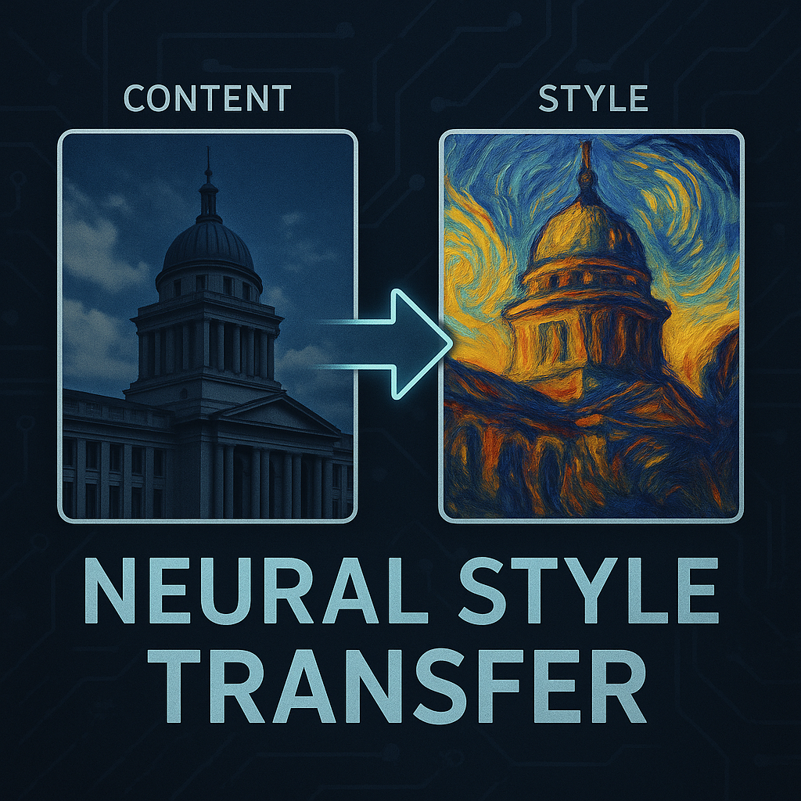

# Neural Style Transfer

## References

1. [SPAST: Arbitrary Style Transfer with Style Priors via Pre-trained
Large-scale Model](https://arxiv.org/pdf/2505.08695),
2. [From Paintbrush to Pixel: A Review of Deep
Neural Networks in AI-Generated Art](https://arxiv.org/pdf/2302.10913),
3. *(Tomek)* [An Analysis for Image-to-Image Translation and Style Transfer](https://arxiv.org/pdf/2408.06000)
4. [Domain-Specific Mappings
for Generative Adversarial Style Transfer](https://arxiv.org/pdf/2008.02198)
5. [AdaAttN: Revisit Attention Mechanism in Arbitrary Neural Style Transfer](https://arxiv.org/pdf/2108.03647)
7. [UNIT](https://github.com/mingyuliutw/UNIT)
8. *(Tomek)* [Style Transfer Review: Traditional Machine Learning to
Deep Learning](https://mdpi-res.com/d_attachment/information/information-16-00157/article_deploy/information-16-00157-v2.pdf?version=1740053966)
9. *(Tomek)* [AdaAttN: Revisit Attention Mechanism in Arbitrary Neural Style Transfer](https://arxiv.org/pdf/2108.03647)

## Considered model architectures

- CycleGAN
- UNIT
- Diffusion-based
- StyleGAN
- GauGAN
- VAE-GAN?
- Pix2Pix
- AdaIN
- DSMAP (unsupervised image translation)

## Evaluation methods

- Domain-Invariant Percep-
tual Distance (DIPD),
- Structural Sim-
ilarity Index Measure (SSIM),
- Learned
Perceptual Image Patch Similarity (LPIPS),
- Frchet Inception Distance (FID),
- Kernel Inception Distance (KID)

## Milestones

### 1

- Theory and interesting aspects of the topic.
- Insights from research papers.
- Finalized topic.
- **Model performance evaluation**
