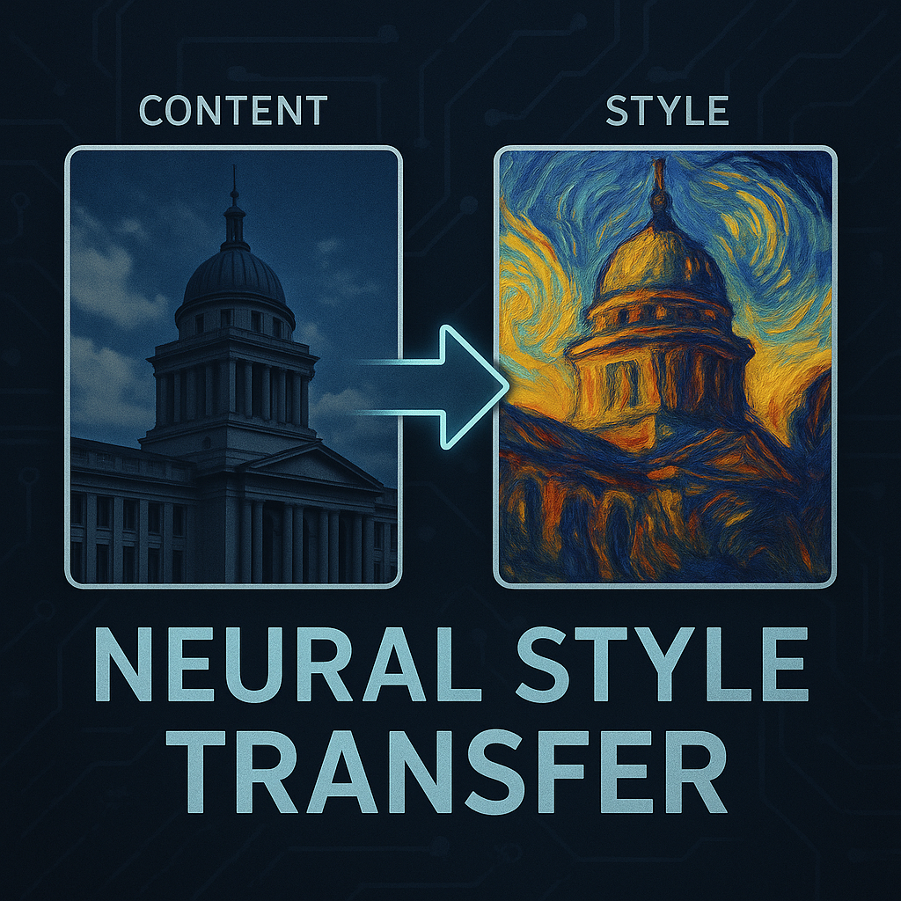

# Neural Style Transfer

## Implemented models

1. CNN generator net with VGG-19-based perceptual loss
2. CycleGAN

## References

1. [SPAST: Arbitrary Style Transfer with Style Priors via Pre-trained
Large-scale Model](https://arxiv.org/pdf/2505.08695),
2. [From Paintbrush to Pixel: A Review of Deep
Neural Networks in AI-Generated Art](https://arxiv.org/pdf/2302.10913),
3. [An Analysis for Image-to-Image Translation and Style Transfer](https://arxiv.org/pdf/2408.06000)
4. [Domain-Specific Mappings
for Generative Adversarial Style Transfer](https://arxiv.org/pdf/2008.02198)
5. [AdaAttN: Revisit Attention Mechanism in Arbitrary Neural Style Transfer](https://arxiv.org/pdf/2108.03647)
6. [UNIT](https://github.com/mingyuliutw/UNIT)
7. [Style Transfer Review: Traditional Machine Learning to
Deep Learning](https://mdpi-res.com/d_attachment/information/information-16-00157/article_deploy/information-16-00157-v2.pdf?version=1740053966)
8. [AdaAttN: Revisit Attention Mechanism in Arbitrary Neural Style Transfer](https://arxiv.org/pdf/2108.03647)
